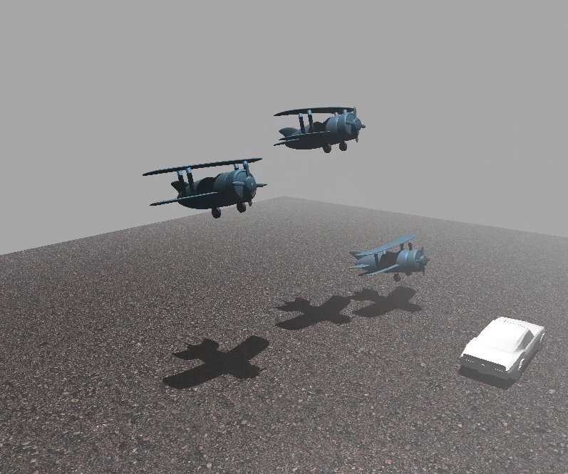

# Collision-Simulator

- Initial Creation Date: April 15, 2026  
- Most Recent Update: April 16, 2026  

---



- **Note:** Additional screenshots and project images can be found in the `docs/` folder.

---

## Project Overview

Collision-Simulator is a Java-based 3D physics and rendering engine built using LWJGL.  
It demonstrates real-time simulation of vehicles (cars and planes) interacting within a bounded 3D world, featuring collisions and GUI-based control systems.

The project focuses on:
- 3D collision detection using sphere-based physics
- Plane and car movement systems with distinct constraints
- Scene management with dynamic object spawning
- Real-time input and GUI-based control
- Terrain rendering with texture mapping
- Lighting and environment simulation

---

## Tech Stack

- **Java 21**
- **LWJGL 3**
- **JOML**
- **Maven**
- **OpenGL Rendering Pipeline**
- **Blender / OBJ Models**
- **Poly Haven Textures**

---

## Key Features

- Vehicle inheritance system (Vehicle is the parent of Car & Plane)
- Unified collision system using CollisionManager
- Plane-to-plane, plane-to-car, and car-to-car physics
- Boundary enforcement for all vehicles
- Terrain-based world with corrected ground alignment
- GUI-controlled spawning, movement, and scene reset
- Real-time camera control system

---

## How to Run

1. Clone the repository  
2. Open in IntelliJ IDEA (or any Java IDE)  
3. Ensure Java 21 is installed  
4. Build using Maven  
5. Run `org.lwjglb.game.Main`

---

## Initial Development Setup

1. Create GitHub repo and name it Collision-Simulator
2. Download Game_02.zip from Brightspace (INFT4000)  
3. Extract to a development folder (e.g. C:\Development\Source\GitHub)  
4. Rename folder to Collision-Simulator  
5. Initialize Git: `git init`
6. Create .gitignore and add include necessary file formats and folders
7. Stage files: `git add .`
8. Commit: `git commit -m "chore: initial commit with provided project"`
9. Set main branch: `git branch -M main`
10. Add remote: `git remote add origin https://github.com/LeonWasHere/Collision-Simulator.git`
11. Push: git push -u origin main

---

## Assets & References

- Savva, D. (2025). *Asphalt track* [Texture]. Poly Haven. https://polyhaven.com/a/asphalt_track  
- Tytel, R. (2025). *Blue metal plate* [Texture]. Poly Haven. https://polyhaven.com/a/blue_metal_plate  
- Tytel, R. (2019). *Green metal rust* [Texture]. Poly Haven. https://polyhaven.com/a/green_metal_rust  
- Savva, D. (2025). *Black painted planks* [Texture]. Poly Haven. https://polyhaven.com/a/black_painted_planks  

---

## References

- LWJGL. (n.d.). https://www.lwjgl.org/  
- GitBook. (n.d.). *3D game development with LWJGL*. https://lwjglgamedev.gitbooks.io/3d-game-development-with-lwjgl/content/  
- Conventional Commits. (n.d.). https://www.conventionalcommits.org/en/v1.0.0/  
- GeeksforGeeks. (n.d.). *Git naming conventions*. https://www.geeksforgeeks.org/git/how-to-naming-conventions-for-git-branches/  

---

## Development Notes

- There are two earlier versions of this project where I encountered Git and project structure issues that affected stability and setup.  
- Copilot AI (2026) was used to support the planning of mathematical collision logic, particularly for plane physics and reflection calculations.

---

## Workflow Guidelines

This workflow was established on April 15, 2026 to introduce a structured development process for the Collision-Simulator project.
It defines standards for branching and commit practices to ensure consistency and version control best practices.

---

### Branching Structure

This project follows a clear branching model:

- **main**: contains the initial project setup and all stable, production-ready code  
- **feature branches**: used for developing new features, fixes, or enhancements  

All development work must be completed in a feature branch and merged into `main` through a Pull Request.

---

### Branch Naming Convention

Branches must follow the format:
- feature/vehicle-base
- feature/car
- feature/Collision-Simulator
- docs/workflow-Guidelines

---

### Commit Message Guidelines

This project follows the **Conventional Commits** standard:  
https://www.conventionalcommits.org/en/v1.0.0/

---

#### Common Commit Types

- **chore**: maintenance tasks or setup  
- **docs**: documentation changes  
- **feat**: new feature implementation  
- **fix**: bug fixes  
- **refactor**: code restructuring without changing behavior  
- **test**: adding or updating tests  
- **merge**: merging branches or pull requests

---

### Commit Message Format

All commit messages must follow this format:

```
type: <description>
```

Example:

```
docs: add documentation for branching strategy and commit standards
```

---
